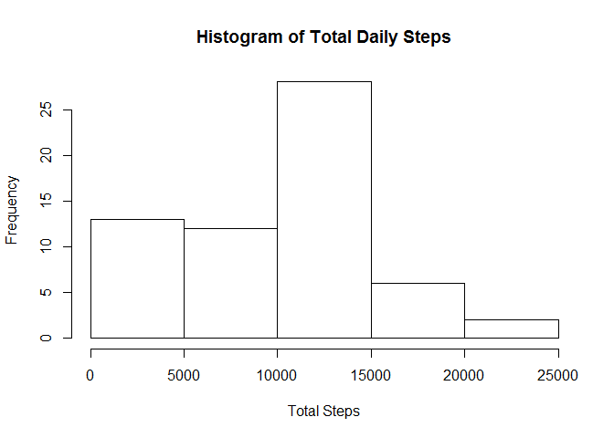
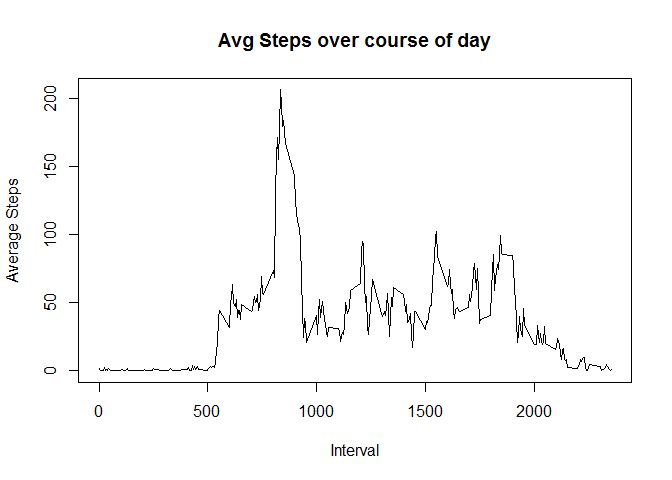
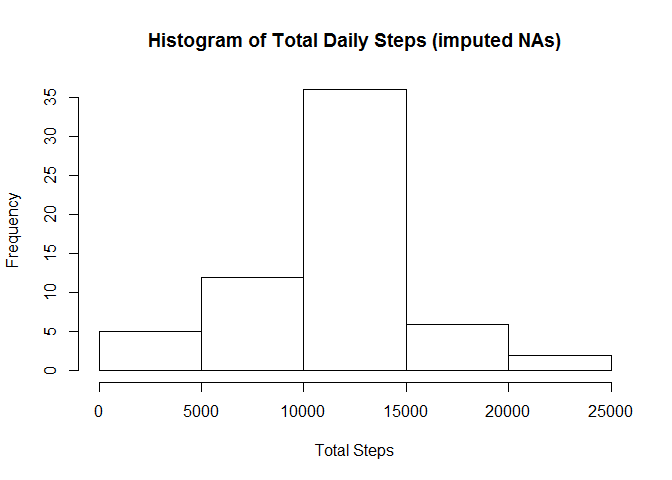
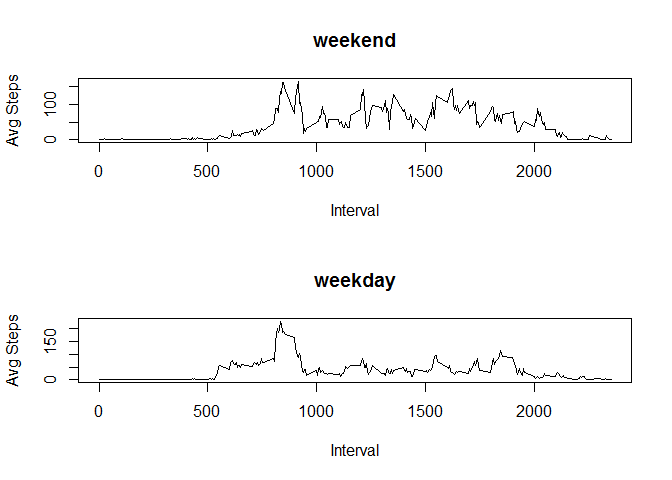

# Reproducible Research: Peer Assessment 1


## Loading and preprocessing the data

Read in unzipped activity.csv file and store into variable called mydata, load dplyr library


```
## Warning: package 'dplyr' was built under R version 3.3.3
```

```
## 
## Attaching package: 'dplyr'
```

```
## The following objects are masked from 'package:stats':
## 
##     filter, lag
```

```
## The following objects are masked from 'package:base':
## 
##     intersect, setdiff, setequal, union
```


## What is mean total number of steps taken per day?

Total steps taken in a day will be calculated by summing up all the steps taken in a given day.


```r
totalsteps <- formatC(sum(mydata$steps, na.rm= TRUE), format="d", big.mark=",")
```

In the sampleset, **570,608** steps were taken.

Create a histogram of the total number of steps for each day by

* grouping by date

* Using summarize to sum total for each date

* Create histogram


```r
dailysteps <- group_by(mydata, date)
dailysummary <- summarize(dailysteps, TotalSteps = sum(steps, na.rm=TRUE))
hist(dailysummary$TotalSteps, main="Histogram of Total Daily Steps", xlab ="Total Steps")
```

<!-- -->

Calculate mean and median number of steps taken over sample period


```r
  mymean <- formatC(mean(dailysummary$TotalSteps), format="d", big.mark=",")
  mymedian <- formatC(median(dailysummary$TotalSteps), format="d", big.mark=",")
```

Over the sample period, **9,354** steps were taken in the average day, with a median of **10,395** steps.

## What is the average daily activity pattern?

First step is to group the data by interval, and then summarize the means by interval.  Finally, the results are plotted.


```r
myinterval <- group_by(mydata, interval)
intervalsummary <- summarize(myinterval, AvgSteps = mean(steps, na.rm = TRUE))
plot(intervalsummary$interval, intervalsummary$AvgSteps, type="l", xlab="Interval", ylab = "Average Steps", main="Avg Steps over course of day")
```

<!-- -->


Calculate which interval has the highest average number of steps taken.


```r
maxintindex <- which.max(intervalsummary$AvgSteps)
maxint <- intervalsummary$interval[maxintindex]
```

The maximum average number of steps taken occurs at the **104**th interval, which corresponds to the 5-minute period starting at minute number **835**


## Imputing missing values

Calculate the total number of days/intervals where there are missing values


```r
  missingvalue <- sum(!complete.cases(mydata))
```

There are **2304** entries that contain NA's.


Impute the missing values by assigning the average steps taken for that interval.  To do so, we define an impute.mean function.  We then recreate the histogram and calculated means and medians.


```r
  impute.mean <- function(x) replace(x, is.na(x), mean(x, na.rm=TRUE))
  myinterval2 <- mutate(myinterval, steps = impute.mean(steps))
```

```
## Warning: package 'bindrcpp' was built under R version 3.3.3
```

```r
  dailysteps2 <- group_by(myinterval2, date)
  dailysummary2 <- summarize(dailysteps2, TotalSteps = sum(steps))
  hist(dailysummary2$TotalSteps, main="Histogram of Total Daily Steps (imputed NAs)", xlab ="Total Steps")
```

<!-- -->

```r
  mymean2 <- formatC(mean(dailysummary2$TotalSteps), format="d", big.mark=",")
  mymedian2 <- formatC(median(dailysummary2$TotalSteps), format="d", big.mark=",")
```


After imputing missing values, **10,766** steps were taken in the average day, with a median of **10,766** steps.  After imputation, the average number of steps and median both increase.  


## Are there differences in activity patterns between weekdays and weekends?

Add additional column to data to identify weekend vs. weekdays.  This column will be converted to a factor.  We'll create a pair of line plots to compare weekend activity vs. weekday activity using base plot package.  We'll accomplish this by subset the data in weekend and weekday subsets.


```r
  myinterval2$date <- as.Date(myinterval2$date)
  
myinterval2$weekend <- as.factor(ifelse(grepl("S.+", weekdays(myinterval2$date)), "weekend", "weekday"))

  weekend <- filter(myinterval2, weekend=="weekend")
  weekday <- filter(myinterval2, weekend=="weekday")
  weekendsummary <- weekend %>%
    group_by(interval) %>%
    summarize(AvgSteps = mean(steps))
  weekdaysummary <- weekday %>%
    group_by(interval) %>%
    summarize(AvgSteps = mean(steps))
  par(mfrow=c(2,1))
  plot(weekendsummary$interval, weekendsummary$AvgSteps, main="weekend", type="l", xlab="Interval", ylab="Avg Steps")  
 plot(weekdaysummary$interval, weekdaysummary$AvgSteps, main="weekday", type="l", xlab="Interval", ylab="Avg Steps") 
```

<!-- -->
